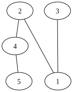

# Теория графов

В рамках данного курса обучения был разработан класс для работы с графами
Реализованы основные методы работы с графом.

* Удаление и добавление вершины гарфа
* Удаление и добавление дуги в графе
* Изменение вершины и дуги
* Сетеры и геттеры на получение значений всего гарфа, так и отдельных компонентов

Данный класс позволяет работать с разными типами переменных, как с весами вершины.

[Интерфейс графа](graph/graph.go)

[Имплементация графа для хранения в памяти](graph/store.go)

[Имплементация напрпавленного графа](graph/directed.go)

[Имплементация ненаправленного графа](graph/undirected.go)

Пример обычного графа

