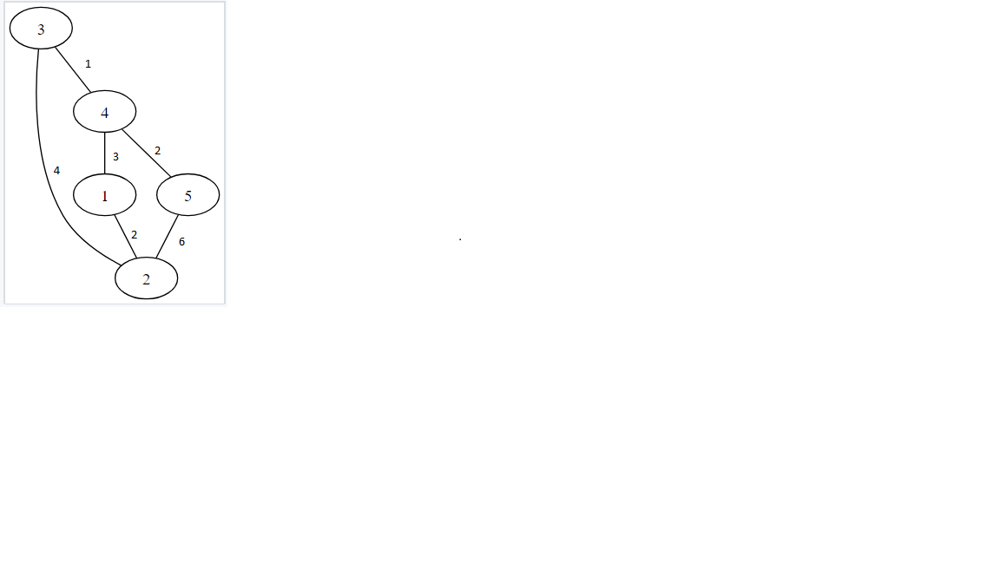

# Теория графов

### Задание 1: Разработать класс Граф

В рамках данного курса обучения был разработан класс для работы с графами
Реализованы основные методы работы с графом.

* Удаление и добавление вершины гарфа
* Удаление и добавление дуги в графе
* Изменение вершины и дуги
* Сетеры и геттеры на получение значений всего гарфа, так и отдельных компонентов

Данный класс позволяет работать с разными типами переменных, как с весами вершины.

[Код программы](main.go)

[Интерфейс графа](graph/graph.go)

[Имплементация графа для хранения в памяти](graph/store.go)

[Имплементация напрпавленного графа](graph/directed.go)

[Имплементация ненаправленного графа](graph/undirected.go)

Пример обычного графа

### Задание 2: Вывести те вершины, полустепень захода которых меньше, чем у заданной вершины.

Соотвественно задаем нужную нам вершину, пусть это будет 4 вершина.
Нужно найти все вершины, у которых полустепень захода будет меньше 4 вершины, то есть меньше 1. Ответ должен быть 1 вершина.

Наш изначальный граф

[Код программы](lab2.go)

### Задание 3: Выяснить, является ли граф связным

Для выяснения этого нужно построить граф и проверить что из любой вершины можно попасть в любую вершину

Изначальный граф

[Код программы](lab3.go)

Вывод программы

### Задание 4: Найти все вершины орграфа, из которых существует путь в данную

Дан орентированный граф. Есть заданная вершина, например 4. Надо найти все вершины, из которых существует путь в данную.

Начальный граф:

[Код приложения](lab4.go)

Вывод:

### Задание 5: Дан взвешенный орентированный граф. Требуется найти в нем каркас минимального веса.

Используем алгоритм Крускала:

Алгоритм Крускала изначально помещает каждую вершину в своё дерево, а затем постепенно объединяет эти деревья, объединяя на каждой итерации два некоторых дерева некоторым ребром. Перед началом выполнения алгоритма, все рёбра сортируются по весу (в порядке неубывания). Затем начинается процесс объединения: перебираются все рёбра от первого до последнего (в порядке сортировки), и если у текущего ребра его концы принадлежат разным поддеревьям, то эти поддеревья объединяются, а ребро добавляется к ответу. По окончании перебора всех рёбер все вершины окажутся принадлежащими одному поддереву, и ответ найден.

[Ссылка на алгоритм](https://e-maxx.ru/algo/mst_kruskal)

Изначальный граф:

[Код программы](lab5.go)

Результат:

